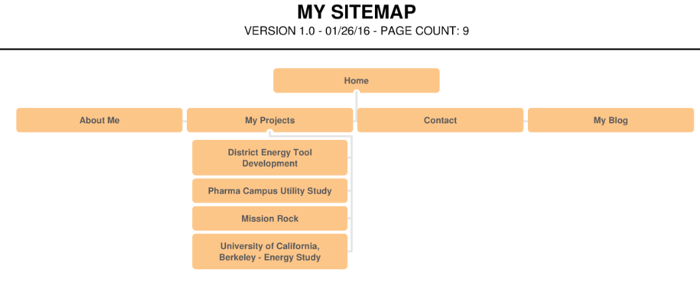

# DESIGN REFLECTION

### 1. What are the 6 Phases of Web Design?

The 6 phases of web design are:

#### 1. Information gathering
* Understanding the purpose
* Understanding content
* Understanding target audience
* Understanding goals

In this stage, designers try to figure out why there is a need for the site to exit. It is therefore perhaps the most important stage in the process, as it determines they "what, why and for who" questions about the site.

#### 2. Planning

In this stage, the designer organizes the information gathered in phase 1 into a structured and logical order. THe designer will explore how many pages and sub-pages are appropriate, and how best they should be tiered. Understanding this structure is important before diving into the design phase, and should really determine the design (and not the other way around) 

#### 3. Design

In this stage, the designer will use the information gathered in phase 1 (such as target audience, type of content etc) to select fonts and colors, and will create a wire-frame of what the site might look like.  

#### 4. Development

This stage is the conversion of the of the design into a site. Designers will use html to capture all the content gathered and provide a rough skeleton of structure as determined in the planning phase, and then use CSS to make the site look and feel as determined in the design phase.

#### 5. Testing and Delivery

At this stage, the designer will apply final touches, test in preparation of delivery, and finally deliver the site to the client. 

#### 6. Maintenance

Once delivered and hosted, the site may require regular updates and/or additional content. The designer may stay involved for this stage, or a Content Management System (CMS) may allow the client to make these changes and updates on their own.

### 2. What is your site's primary goal or purpose? What kind of content will your site feature?

The goal of my site is to share a little bit about myself, showcase some of my projects, and provide visitors with a way of getting in touch with me. A site map is included below to visualize these main sections of my site.

### 3. What is your target audience's interests and how do you see your site addressing them?

My target audience are interested in sustainability at the campus or district scale, and by showcasing my experience in that area I hope to attract their attention and feedback.

### 4. What is the primary "action" the user should take when coming to your site? Do you want them to search for information, contact you, or see your portfolio? It's ok to have several actions at once, or different actions for different kinds of visitors.

The primary action I would want the user to take would be to read a little bit about me and/or jump to my projects to understand how they might be relevant to their needs.

### 5. What are the main things someone should know about design and user experience?

Design to me is all about solving problems through the application of some skill or some specialized technical knowledge. Design to me is also a process, and the stages are mode or less typical (problem definition, planning, implementation, and feedback, and sometimes continued improvement)

User experience is more about measuring and trying to improve certain aspects a users experience when using the thing that is being designed. These aspects can range from hard metrics like average length of time of use and clarity of navigation (or intuitiveness), to softer metrics like ease or simplicity of use, or simply "pleasure derived" from use. 

### 6. What is user experience design and why is it valuable? 

User experience (UX) design deals with making the users interaction with a website (or any product really) more intuitive and enjoyable. I remember visiting the Smart Design studio in San Francisco many years ago and seeing sample of their projects ranging from kitchen knives, to remote controls, to websites. It's all about studying how users use the product, finding out what they like and don't like, and trying to make the product more enjoyable for them to use. One reason why UX design is important is because with so much traffic and content on the Internet, one of the factors that may differentiate a site or influence a user to use a product is their experience of that interaction.  

### 7. Which parts of the challenge did you find tedious?

