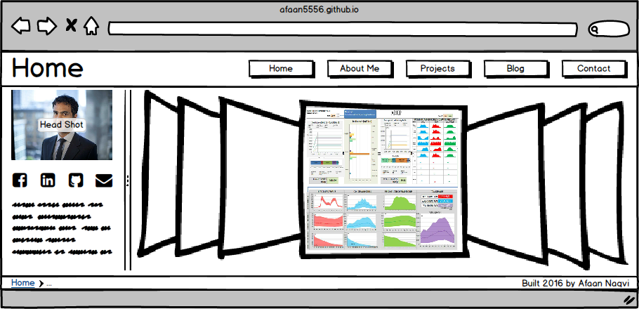
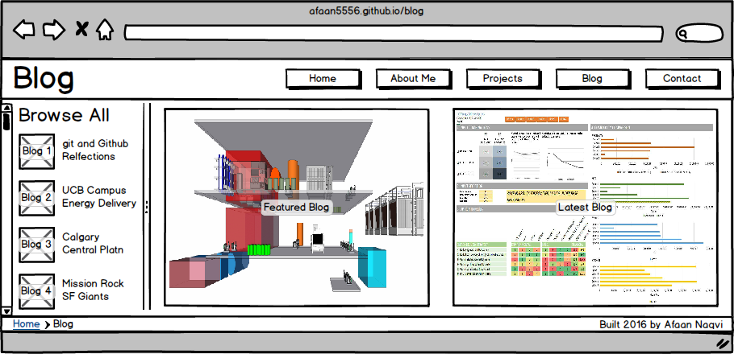

# What is a Wireframe?

A wireframe is a "mock-up" of a screen design. Its intent is not to be dynamic or functional, but to capture on paper/screen the general layout, structure, and information hierarchy of a site. It is an important step in the design process as it organizes the information gathered in the first step of the design process (information gathering) and gives the designer a road-map on how best to use that information in the third and fourth steps (design and development) of the design process.

# What are the Benefits of Wireframing?

For me, there are two key benefits of wireframing. The first is that it manages the transition from raw information to coding. It does this by providing a visual guide for what elements are needed, their relative importance, and how they should be laid out on the site. Wireframing optimizes this transition by allowing quick mock-ups that can lead to rapid-prototyping of code for sites that can be iteratively improved through subsequent iterations of the wireframe.

The second has to do with user experience. Wireframing forces a step in the process before code is ever written that centers around thinking about how the user will interact with the site. This is another place where the quick nature of wireframing comes in handy in that several wireframes can be created to represent the various states of navigation, button options, and menu behavior. As wireframes are typically black-and-white without polished images or shiny features, this means focused thought is given at this stage to how the user will interact with the actual content of the site using cause-and-effect thinking rather than graphics. 

<!--
# Reflections

### I Enjoyed Wireframing my Site!
Wireframing is just so much fun! The free tools available make it so enjoyable (I used balsamiq) and the rapid prototyping aspect of it is something I can see myself appreciating for some time to come.

### I Revised my Site Wireframe
I made some basic revisions to my site wireframe such as the placement of tiled images, adding a vertical scroll bar, adding breadcrumbs manually, and then instead using one of the built in tools, and other such similar revisions.

### I Asked Questions and Looked into Resources
I have a few highly experienced UX designer friends and I wondered to myself if they still resort to basic wireframing in their day-to-day roles. I was curious about some of the differences between some of the wireframing tools and looked into a couple to test them out and see which one I liked and could see myself using going forward.

### I Enjoyed the Challenge 
Yes! Not only this solo challenge, but also the paired challenge in which we wireframed one of the actual blog post pages and even wrote out an html template for it.
-->

