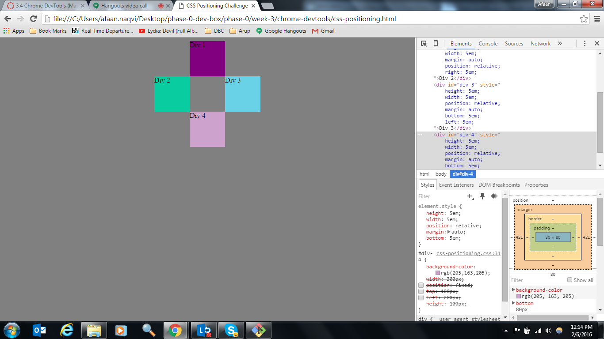

# Assingment 3.4 Reflection
#### February 6, 2016

### How can you use Chrome's DevTools inspector to help you format or position elements?
The Chrome DevTools inspector can be used to view, inspect, and tinker with the css code and the resulting web-page side-by-side in real time. This is tremendously helpful as it provides a very tight feedback loop into the cause and effect of css styles. This becomes especially helpful when trying to format and position elements. Without Chrome DevTools the work-flow is to update the css code, save the file, and then refresh the browser. Not terrible, but long enough to be tempted to make 3 or 4 changes before saving and refreshing the browser. This  often leads to confusion when viewing the updated browser as it has left me guessing at which change caused which effect.

### How can you resize elements on the DOM using CSS?
You can locate the element in the DOM and then change its width/height properties as needed. 

### What are the differences between absolute, fixed, static, and relative positioning? Which did you find easiest to use? Which was most difficult?
This was one of the trickiest concepts so far!
It seems I am not the only one struggling with this though as there has been plenty of chatter about it on Slack, and there are some pretty handy interactive demos available to help understand this. Here is where I landed.

#### Static
Static positioning is the default position of all elements, and is a visual representation of the natural tree-location position of that element. Without any arguments, 4 static elements one-after-another in a tree will end up as 4 stacked blocks.  

#### Relative
Relative positioning is similar to static, except that it allows for additional placement dimension arguments (top/bottom/left/right) that visually place the element is a given location relative to the actual location of the element. The actual DOM location of the element stays reserved and unobstructed by other elements even though visually the element is not located there. 

#### Absolute
Absolute positioning is similar to relative positioning in that it allows for placement dimension arguments (top/bottom/left/right) but is different in that the natural DOM position of the element is not held/reserved. The element is effectively pulled out of the DOM and placed relative to its parent element and the given dimensions, without the reservation of its natural place in the DOM (i.e. other elements are allowed to fill in the space that would otherwise be occupied by the absolute element.)

#### Fixed
Fixed positioning ignores all parents and children of the given element, and just sticks to a position on the browser as dictated by the left/right/top/bottom arguments given. The position of a fixed element does not change as you scroll up/down or left/right on the browser, or when you re-size the browser. 

### What are the differences between margin, border, and padding?

MARGIN is the space surrounding the border of the element.
BORDER is the edge of the element itself.
PADDING is the space between the element content and its edge/border

### What was your impression of this challenge overall? (love, hate, and why?)
Positioning itself (without Chrome DevTools) started out as  mostly a hate experience, as I spent almost a full day without any success. Then there was a little bit of love when I persisted (and also took a step back) and actually started making some progress. By the time I got to this challenge, I had started to feel somewhat comfortable with positioning, only to find the amazing tool-kit that is Chrome Devtools. I am pretty sure I will love it from here, and that I will be using Chrome Devtools extensively on my index.html and my blog pages. 