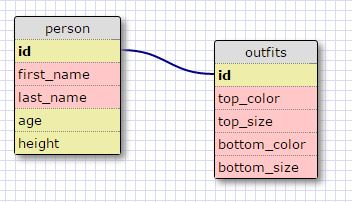

# 8.4 Introduction to Database Schemas and SQL
#### March 8, 2016

### 1. Select all data for all states
SELECT * FROM STATES;

### 2. Select all data for all regions
SELECT * FROM REGIONS;

### 3. Select the `state_name` and `populationn` for all states
SELECT state_name, population FROM STATES;

### 4. Select the `state_name` and `population` for all states by population. The state with the  highest population should be at the top.
SELECT state_name, population FROM states ORDER BY population DESC;

### 5. Select the `state_name` for states in region 7
SELECT state_name from STATES WHERE region_id=7;

### 6. Select the `state_name` and the `population_density` for states with a population density over 50 ordered from least dense to most dense
SELECT state_name, population_density FROM states WHERE population_density > 50 ORDER BY population_density;

### 7. Select the `state_name` for states with a population between 1 million and 1.5 million people
SELECT state_name FROM states WHERE population > 100000 AND population < 1500000;

### 8. Select the `state_name` and `region_id` for states ordered by region in ascending order
SELECT state_name, region_id FROM states ORDER BY region_id;

### 9. Select the `region_name` for the regions with "Central" in the name
SELECT region_name FROM regions WHERE region_name LIKE '%Central';

### 10. Select the `region_name` and `state_name` for all states and regions in ascending order by `region_id`. Refer to the region by name.
SELECT regions.region_name, states.state_name FROM states INNER JOIN regions ON regions.id=states.region_id ORDER BY region_name;

## REFLECTION

#### What are databases for?
Databases are used to store data in a structured way for easy access, modification, or updating in the future.

#### What is a one-to-many relationship?
A one to many relationship refers to a type of cardinality (or relationship) between tables of data or databases whereby 1 record in the first table/database can be associated to several records in the second.

#### What is a primary key? What is a foreign key? How can you determine which is which?
A primary key is a unique identifier for a record of data. A foreign key is an attribute of an entity that refers to the primary key of another entity

#### How can you select information out of a SQL database? What are some general guidelines for that?
By using a SELECT query. A SELECT query needs to include the name of the database being queried, as well as the columns of interest (or a * can be used to select all columns) and must end with a ;