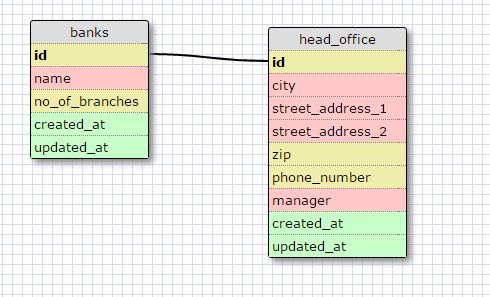
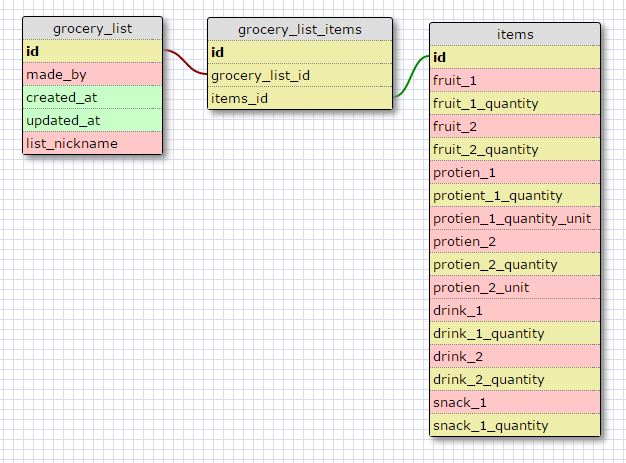

# 8.5 More Schemas
#### March 9, 2016

### One-to-One Databases and When to Use Them

A one-to-one database is used when two entities form a natural pair, or have an "exclusive relationship." This means that a record in the second entity will not be able to be "claimed" by more than 1 record in the first (i.e. there is only 1 unique record of the second enetity-type that exists for each record in the first entity) A general rule for when to use a one-to-one database is when a group of fields can optionally be left empty.

### Many-to-Many Databases and When to Use Them

A many-to-many database is used when two entities have a "non-exclusive relationship." That means that there can be several instances of the second entity that relate to the first, as well as the other way around. As soon as records in either entity can "claim" more than one record in the other, a one-to-one database will no longer be appropriate, and instead a many-to-many database should be used.

### What is Confusing About Database Schema and What Makes Sense

I have lived in excel hell for the last 9 years, and so the concept of tables, rows, and columns made immediate sense. The concept of a unique id was also something that made sense, but the concept of local/unique and foreign keys was new and confusing at first. This was cleared up with a few examples. The idea of a join table in many-to-many datacases makes sesne in concpet, but I feel it will take a couple of examples and some practice to be fully comfortable with it.